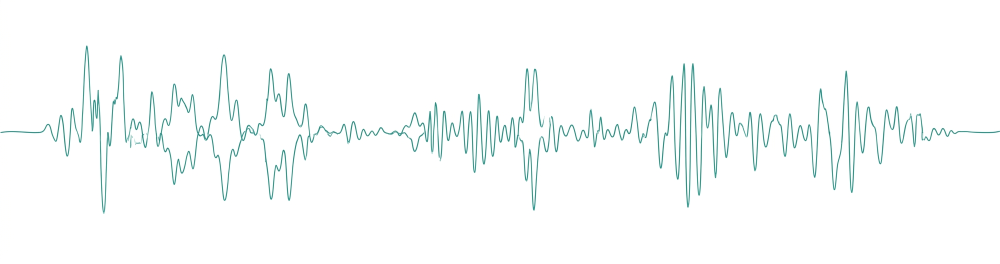
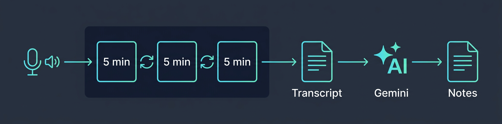

<p align="center">
  
</p>

<p align="center">
  <em>Record meetings, lectures, brainstorms — get structured notes in Obsidian automatically.</em>
</p>

---

[Wispr Flow](https://wispr.com) is the best voice-to-text on macOS, but it caps recordings at 6 minutes. This tool removes that limit — it silently cycles recordings in the background, stitches the transcriptions, and sends the full transcript to an LLM to generate structured notes that are saved directly to your Obsidian vault.

**Record anything → get organized notes in Obsidian.** Project meetings with action items, paper discussions, lecture notes — all filed into the right folder automatically.

## Install

You need [Wispr Flow](https://wispr.com) installed (do one test recording first).

```bash
curl -fsSL https://raw.githubusercontent.com/yashsmehta/wispr-unleashed/main/scripts/get.sh | bash
```

The installer handles dependencies, LLM setup, and adds a `wispr` command to your shell.

## Usage

```bash
wispr "Meeting Title"
```

Press `Ctrl+C` to stop. Pick a folder in your vault, and notes appear in Obsidian.

Notes adapt to context — project folders get meeting notes with action items, while **Talks** or **Lectures** folders get structured academic notes.

## How It Works

<p align="center">
  
</p>

1. Starts Wispr Flow hands-free recording
2. Silently cycles every 5 minutes (staying under the 6-min limit)
3. Stitches all transcriptions into a single markdown file
4. Sends the transcript to your LLM and saves structured notes to Obsidian

The raw transcript is always saved separately — you never lose the original.

## Configuration

Edit `~/wispr-unleashed/.env`:

| Setting | Default | What it does |
|:---|:---|:---|
| `LLM_MODEL` | `gemini/gemini-2.0-flash` | Model for note generation ([supported models](https://docs.litellm.ai/docs/providers)) |
| `OPENAI_API_KEY` | — | For OpenAI models (`gpt-4o-mini`, `gpt-4o`, etc.) |
| `ANTHROPIC_API_KEY` | — | For Anthropic models (`anthropic/claude-sonnet-4-20250514`, etc.) |
| `GOOGLE_API_KEY` | — | For Gemini models (`gemini/gemini-2.0-flash`, etc.) |
| `OBSIDIAN_VAULT` | `~/Desktop/Obsidian Vault` | Path to your Obsidian vault |
| `TRANSCRIPTS_DIR` | `$OBSIDIAN_VAULT/Transcripts` | Where raw transcripts are saved |
| `USER_NAME` | — | Your name (used for context in notes) |

### Customizing prompts

The prompts that shape your notes live in `~/wispr-unleashed/prompts/`:

| File | Used for |
|:---|:---|
| `meeting_notes.md` | Structured meeting notes |
| `action_items.md` | Action item extraction |
| `talk_notes.md` | Talk / lecture / seminar notes |

Edit these to change the style or structure of your notes. The raw transcript is always preserved in `TRANSCRIPTS_DIR`, so you can tweak prompts and regenerate anytime.

## License

MIT
