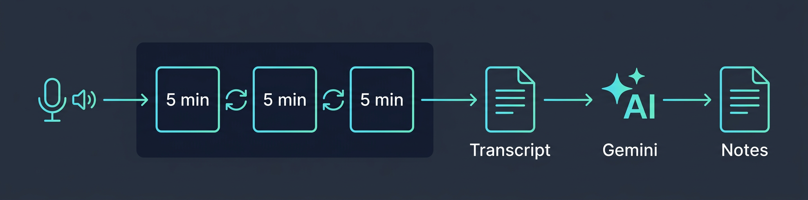

<p align="center">
  
</p>

<p align="center">
  <strong>Long-form Wispr Flow recordings, automatically turned into Obsidian notes.</strong>
</p>

<p align="center">
  macOS · Open source · Bring your own AI provider
</p>

---

Wispr Unleashed records meetings, lectures, brainstorms, and discussions through [Wispr Flow](https://wispr.com), seamlessly cycles past Flow's recording limit, and saves the complete transcript to [Obsidian](https://obsidian.md).

When recording ends, it can also generate structured notes and action items using Google Gemini, OpenAI, Anthropic, or another provider supported by LiteLLM.

## Install

Before starting, install Wispr Flow, complete one test recording, and create or open an Obsidian vault.

Then run:

```bash
curl -fsSL https://raw.githubusercontent.com/yashsmehta/wispr-unleashed/main/scripts/get.sh | bash
```

The guided installer configures your vault, optional AI provider, and the `wispr` command. It uses [uv](https://docs.astral.sh/uv/) to install an isolated Python environment without touching your system packages.

## Record

```bash
wispr "Weekly Standup"
```

Press `Ctrl+C` when finished, then choose where the notes should go in Obsidian. If you omit the title, the current time is used.

Wispr Unleashed will:

1. Record through Wispr Flow in continuous five-minute chunks.
2. Stitch the completed transcriptions into one Markdown file.
3. Preserve the raw transcript in your vault.
4. Generate organized notes and, for meetings, action items.

<p align="center">
  
</p>

> **First run:** Grant Accessibility permission to your terminal under **System Settings → Privacy & Security → Accessibility**. This prevents Flow from pasting each completed transcription into other apps.

## Note styles

The destination folder determines the output:

- `Talks`, `Classes`, `Lectures`, and `Seminars` create structured study notes.
- Other folders create meeting notes with a separate action-items section.
- The vault root is always available.

Prompts are plain Markdown files in `~/wispr-unleashed/prompts/`, so the note structure and writing style are fully customizable. Updates preserve your edited prompts and local `.env` configuration.

## AI configuration

The installer handles this for you, but models can be changed in `~/wispr-unleashed/.env`:

```bash
# Choose one provider key
GOOGLE_API_KEY=your-key
OPENAI_API_KEY=your-key
ANTHROPIC_API_KEY=your-key

# Any compatible LiteLLM model
LLM_MODEL=gemini/gemini-3.1-pro-preview
```

AI is optional: recording and raw transcripts work without an API key.

## Privacy

- Audio and transcription are handled by Wispr Flow.
- Generated notes send the full transcript to your selected AI provider.
- Meeting mode makes two requests: notes and action items.
- API keys stay locally in `.env`; Wispr Unleashed has no server.

Your provider's privacy, retention, billing, and rate-limit policies apply.

## Optional keyboard shortcut

```bash
bash ~/wispr-unleashed/scripts/setup.sh
```

This installs a macOS Quick Action that you can bind to a shortcut such as `Option+Shift+W`.

## Development

```bash
git clone https://github.com/yashsmehta/wispr-unleashed.git
cd wispr-unleashed
uv sync
uv run python -m unittest discover -s tests
```

Requires macOS. Python 3.10+ is provisioned by uv when necessary.

## License

[MIT](LICENSE) © 2026 Yash Mehta
